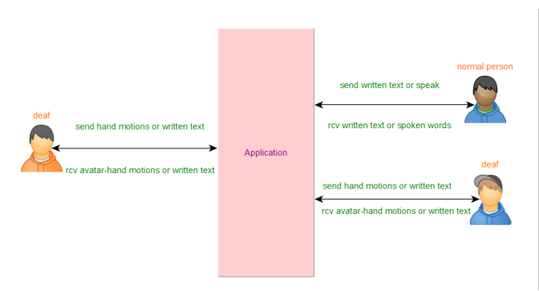
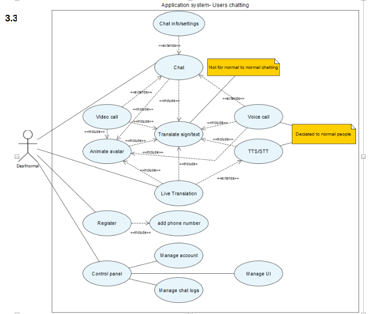
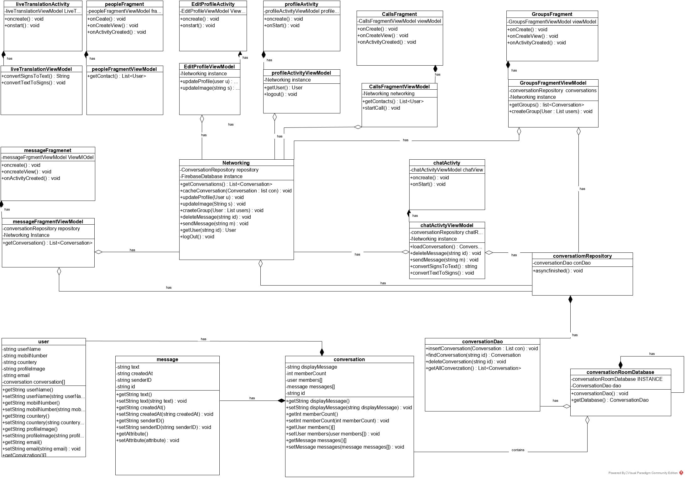
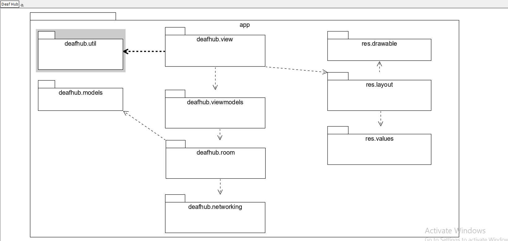
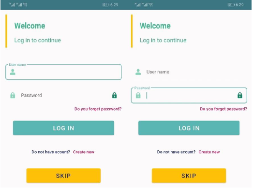
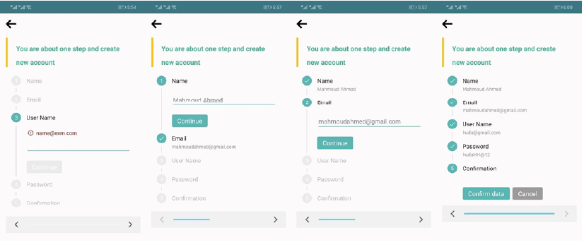
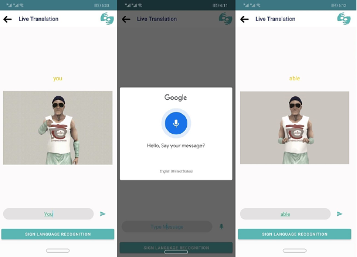
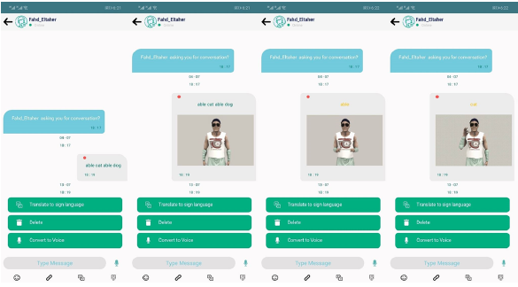
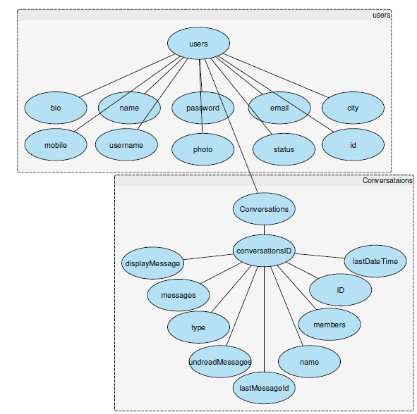

# Murmuro
Deaf People chat app

# Introduction
 This is software requirements specification document for American Sign Language (ASL) translator project.
Sign languages (also known as signed languages) are languages that use the visual-manual modality to convey meaning. Sign languages are expressed through manual articulations in combination with non-manual elements.
The classification of Sign Language families: French Sign Language family, American Sign Language, Russian Sign Language, and many more.

In this project, we aim to translate between American Sign Language and normal English language.

# Document Purpose 
This document is aimed to define the scope and requirements specification of ASL translator system. It provides diagrams that illustrate the operations of the system and how it interacts with users and the environment. The document also presents the functional requirements needed for the system to operate reliably.

The main objective is to translate sign language to text/speech. The framework provides a helping-hand for speech-impaired to communicate with the rest of the world using sign language. This leads to the elimination of the middle person who generally acts as a medium of translation. This would contain a user-friendly environment for the user by providing speech/text output for a sign gesture input. The product is supposed to work as a mobile application as it can be accessible with user anywhere. 

# Product Scope
The project is aimed to break the barriers between deaf people and the rest of the world. 
The scopes for this project are as followed:

    1. Sign language recognition system for deaf and mute people. 
    2. The sign language used is American Sign Language. 
    3. Implementation is based on machine learning methods. 
    4. Recognition of hand gestures and motions is based computer vision and image processing techniques.
    5. Converting text to speech and speech to text.
    6. Creating a model that can be used in any related fields and projects.

Such a project can be used by a person who has difficulties in speaking or by a person who can hear but could not speak, and by normal people to communicate with hearing disabled people. As far as a deaf person is concerned, using the sign language is very important for their social, emotional and linguistic growth.

# Intended Audience and Document Overview
This specification is intended for system developers, project managers, and testers. The document serves as documentation and a system specification for the project.

	
The organization of this document is as follows:

    1- An introduction to project and specification of the document.
    2- Overall description for describing the project functionality, and present design and implementation constraints.
    3- Specific requirements in which the system is required to operate, discussing functional requirements and presenting use case model.
    4- Analysis models that depict system from many perspectives.
    5- Non-functional requirements which specify criteria that can be used to judge the operation of a system, rather than specific behaviours. They are contrasted with functional requirements that define specific behaviour or functions.

# Definitions, Acronyms and Abbreviations (Glossary)
    • ASL: American Sign Language, the language that American deaf community uses.
    • Deaf: A person who is not capable of hearing and speaking.
    • Avatar: An animated character that will be used to interact with deaf.

# Product Perspective
The target product is a development of previous related products for the same problem. Other sign language translator applications only translate text character by character to its analogous hand gesture and motion. Other products translate text by displaying for deaf person a sequence of images or short video clip. Other available products are only translation from text/speech to sign language and do not the reverse. Most of these products require a hard-coding for translating from one language to another. One of available products uses gloves which attempt to convert the motions of a sign language into written or spoken words, but this is unpractical.

Our proposed product is a machine learning based service that dynamically translates English language to American Sign Language and vice versa. The product will be available via a web service that can be used in any related projects.

There are many possible situations where a translation from sign language to another normal language or from normal language to sign language is required. Depending on usage, the situation may give arise to projects that range from small to big ideas. Examples of these situations are:

    • A deaf student who cannot attend a course, or any learning session because his/her disability of hearing.
    • Teaching sign language to concerned people.
    • Enabling a deaf to communicate with the other people easily without intermediate human translator.
    • A corporation may need sign language translation for dealing with deaf people.
    • TV programs need the translation from normal language to sign language.
    • Deaf person wants to converse with his family members or friends. 

All these situations are important and popular in our daily live, so there is a requirement for translation from one form to another. In general, the product will serve deaf people from many aspects to help them communicate with the other as normal people do as possible. The following diagram shows a simple overview of the interaction between users and application:

# Product Functionality 
The product is a general-use service that can be deployed in any related projects and fields. We choose a simple, general and popular idea to deploy the ASL translator model, this idea is represented as an application for chatting between normal and deaf people as well as providing a live translation from one language to another.
The main functionalities of the system are:
    • Translate normal speech/text to sign language and vice versa.
    • Use animated avatar that will interact with deaf people.
    • Enabling deaf to chat with other deaf or normal people. In addition, the system provides users to make video and voice call.
    • Provide live translation from one language to another.
    • Converting text to speech and speech to text.
    • Capturing hand motions and gestures from deaf person.
    
# Users and Characteristics
The ASL translator service is for anyone who develops a project for aiding deaf in some manner.

As a chat application, it can be used by both deaf and normal people.
# Operating Environment
ASL translator will be provided as web service for general use.

Chat and live translation application is targeted for mobile phones which run Android, IOS or windows phone.
# Design and Implementation Constraints
The design of ASL translator model is based on machine learning methods and techniques, its main input format is text, in case of a voice it is converted to text, or sequence of image frames that represent a sign. Capturing of image frames based on computer vision and image processing methods and techniques. 
 
The design of the application should be light on mobile memory to provide a quick translation from a language to another. The avatar will be simple animated character so it does not need many computations to render it on screen.

As our product will operate as a chat application for users, there should be a relational database to save users data and profiles. 

For security requirements, the application will maintain an end-to-end encryption mechanism for providing confidentiality.

Application will provide a user friendly interface with a lot of icons and images so people who cannot read can use application easily.

The avatar will be based on animated motions for each alphabet and word. The translation and capturing of sign language is based on trained machine learning model.

# User Documentation
A full documentation of the translator model will be provided through the web site that hosts model. The site will also have a description of the chat and live translation application. 

# User Interfaces
The user interface is simple as any popular chat application found in the market with a side menu for other functionalities. The difference is in what the product will contain, as noted earlier, the application will consider some deaf people cannot read/write so the application will heavily depend on icons and images. In addition, the application must at the deaf person interface, a major part of the screen is provided for avatar that will model the messages received from other side.

Another essential option is to provide a snug user interface to translate from one language to another in a timely manner to stimulate real-time translation as possible whether it’s a video call conversation or a face to face talk.

The following two figures help you to visualize the interface of the application:

# Watch the Prototype

# Use Case View

# Class Diagram

# Package Diagram

# Sequence Diagram 

# Context Diagram

# Login screen

# Sign up process

# Translating English voice and text into signs

# Chat screen

# Firebase tree

